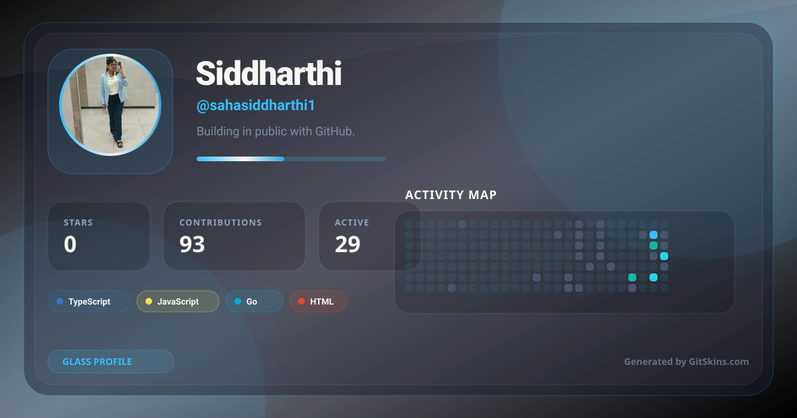
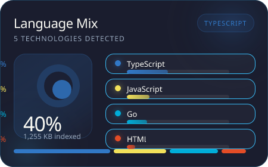
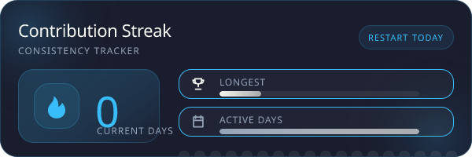
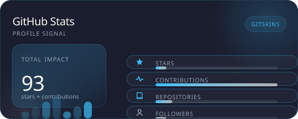

<!-- GitSkins Profile Widgets (Free) -->





<div align="center">

  <!-- ANIMATED BANNER -->
  <div align="center">
    
  </div>

  <!-- TYPING SVG + BADGE ROW -->
  

  <!-- INFO BADGES ROW -->
  <br/>
  <div align="center">
    <a href="https://portfolio-phi-mocha-36.vercel.app/">
      
    </a>
    <a href="https://www.linkedin.com/in/siddharthi-saha-269280259/">
      
    </a>
    <a href="https://github.com/sahasiddharthi1">
      
    </a>
  </div>

</div>

<!-- ABOUT / BIO BLOCK -->
## `> whoami`

Siddharthi Saha | Full-Stack Developer | AI & Distributed Systems | 2+ Years Experience

```bash
$ cat .profile

ROLE     =  Full-Stack Developer
EXP      =  2+ years
DOMAIN   =  AI, Distributed Systems, Cloud Computing
STACK    =  React, Go, TypeScript, AWS Bedrock, Azure OpenAI
OPEN_TO   =  Senior Engineering roles in AI/ML & Cloud Infra
```

<!-- TECH STACK ICONS -->
### Skills

<div align="center">
  
</div>

<!-- DOMAIN EXPERTISE TABLE -->
### Specialization

| Domain | Proficiency | Details |
|--------|-------------|---------|
| AI/ML | Expert | IIT (ISM) Dhanbad certified, AWS Bedrock, Azure OpenAI |
| Distributed Systems | Advanced | Go Kafka, TCP framing, ISR replication, consumer groups |
| Cloud Infrastructure | Advanced | AWS, Azure, Docker, Kubernetes, Terraform |
| Backend Development | Expert | Go, Node.js, Express, MongoDB, Redis, gRPC |

<!-- FEATURED PROJECTS (collapsible) -->
### Featured Projects

<details open>
<summary><b>&#9654; GoKafka</b> - Distributed Kafka Broker</summary>

**One sentence:** Go implementation of distributed Kafka-inspired broker from scratch.

| Aspect | Detail |
|--------|--------|
| **Stack** | Go, TCP binary framing, Gin/Swagger REST bridge |
| **Scale** | Handles 20,000+ jobs/min with exactly-once execution |
| **Impact** | Delivered 40% faster agent creation, 60% TTI improvement at scale |
| **Repo** | [View](https://github.com/sahasiddharthi1/go_kafka) |

*Built GoKafka from scratch — TCP binary framing, append-only segment logs, ISR replication, consumer groups, DLQ, async batch producer.*

</details>

<details>
<summary><b>&#965; ShopFlow</b> - Distributed Job Processor</summary>

**One sentence:** Custom distributed job processor handling 20,000+ jobs/min with exactly-once execution.

| Aspect | Detail |
|--------|--------|
| **Stack** | Node.js, React, AsyncLocalStorage, APM |
| **Scale** | Custom job processor for 20k+ jobs/minute |
| **Impact** | Enterprise-grade distributed system at LTIMindtree |
| **Repo** | [View](https://github.com/sahasiddharthi1/djp) |

</details>

<!-- EXPERIENCE LOG -->
### Experience Log

**Full-Stack Developer** | LTIMindtree | 2024 - Present
- Delivered 40% faster agent creation and 60% TTI improvement through React Flow canvas architecture & Redux Toolkit at scale
- Built GoKafka from scratch in Go — TCP binary framing, ISR replication, consumer groups, DLQ, async batch producer
- Built ShopFlow — distributed job processor handling 20,000+ jobs/min with exactly-once execution
- Designed enterprise platform for building, deploying & governing autonomous AI agents

**Educational Background** | IIT (ISM) Dhanbad | B.Tech Electrical Engineering | 2020-2024

<!-- GITHUB ANALYTICS WIDGETS -->
### GitHub Analytics

<div align="center">
  

  

  <!-- contribution timeline card -->
  
</div>

<!-- GITHUB TROPHIES -->
### GitHub Trophies

<div align="center">
  <a href="https://github-profile-trophy.vercel.app
    ?username=sahasiddharthi1&theme=matrix&no-frame=true&column=7">
    
  </a>
</div>

<!-- ACTIVITY GRAPH -->
### Contribution Activity Graph

<div align="center">
  
</div>

<!-- CONTRIBUTION SUMMARY CARDS -->
### Profile Summary Cards

<div align="center">
  
  
</div>

<!-- CURRENT FOCUS YAML + CONNECT -->
## `> cat current-focus.yaml`

```yaml
learning:
  - AWS Generative AI patterns
  - Advanced distributed systems
  - Go performance optimization

building:
  - Enterprise AI agent platform at LTIMindtree
  - Scalable distributed systems with Go

open_to:
  - Senior Engineering roles
  - AI/ML Infrastructure positions
  - Distributed systems challenges

<!-- CONNECT -->
<div align="center">
  <a href="mailto:siddharthi.saha@example.com">
    
  </a>
  <a href="https://www.linkedin.com/in/siddharthi-saha-269280259/">
    
  </a>
  <a href="https://portfolio-phi-mocha-36.vercel.app/">
    
  </a>
</div>

<!-- SNAKE ANIMATION -->
<div align="center">
  
</div>

<!-- CAPSULE RENDER FOOTER -->
<div align="center">
  
</div>